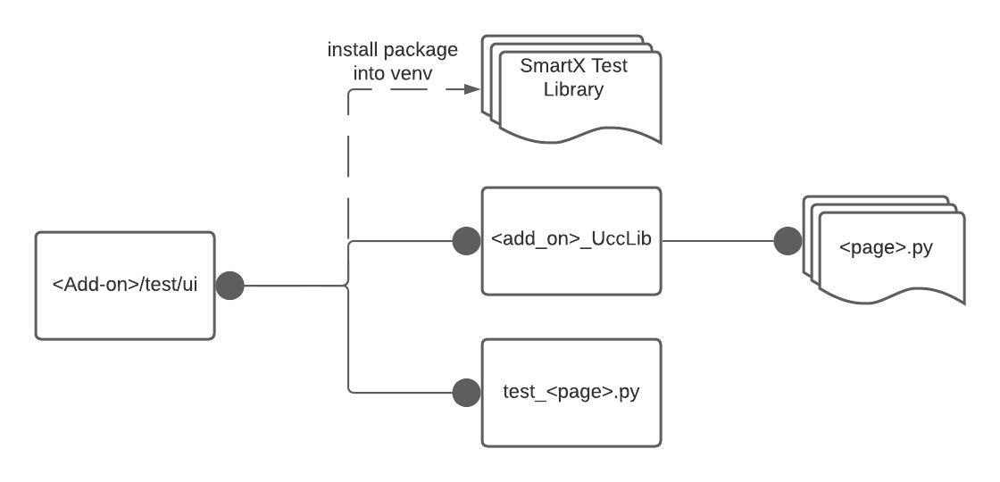

Overview
========
UCC based Add-on UI automation framework 
Confluence Page link: 
`SmartX Repo <https://confluence.splunk.com/display/PROD/SmartX+UI+Automation+Framework+for+Ucc+based+Add-ons>`_

The goal of SmartX is to be a UI testing framework to test the UCC UI pages for Splunk Add-ons. 
All the add-ons are built with the same template, and such contain consistent input and configuration pages specified for each. To test all of the add-ons easily, a generic framework was created, which can be used to test all the add-ons.

Design
------
We follow a practice in which we create a set of components first, which would be replaceable and can be utilized on any page. A web-page will be a composition of these components, placed in the proper containers.
The design of the framework will consist of the following 3 parts:

    * Components: A UI component that the user would interact with. This component should consist of methods to interact with the UI component, such as the get and set values in the container. Components will have a set of locators that will be interacted with. (Locators are any type which are supported by selenium)
    * Pages: The page holds multiple Components and represents a specific web page for the Add-on. The page should only be used to contain the set of components, and no interaction methods should be made within the Page class.
    * Test Cases: Tests the interaction and values in the components. The tests should only test one functionality at a time and should interact with one page at a time. Through interaction with more than one page should be sequential. 

The design of the framework is as follows:

.. image:: UI-Framework.jpeg
    :align: center
    :alt: Flow diagram

File structure
--------------
The tests should be structured in the following format:
    * test/ui: The parent ui-test directory in which we should put all of our SmartX test cases within.
    * test/ui/<TA>_UccLib: The specific TA's unique page files that we want to test.
    * test/ui/test_<test_suite>.py: The test cases for a specific TA page or Input.  

We would install SmartX as a package in a virtual environment.
The general file structure of pytest_splunk_addon_ui_smartx is as follows:

Support
-------

* **Python**: 3.9
* **Platforms**: Linux, Windows, and MacOS

Features
--------
    * pytest fixture to control when the browser should be initialized & tear-downed.
    * Flag to easily convert the environment from SauceLabs to local for debugging purposes.
    * Screenshots when any test case fails.
    * An Html and logger report containing the trace-back and the screenshots of the failed test cases.
    * Pytest parameters to change the URL and the credentials of the test Splunk instance.
    * Pytest fixtures that are used to run some code before every test method or class. Used to initialize the browser we need in every test case and to login to the Splunk Instance
    * Backend configuration can be fetched from the management API of the Splunk instance.
    * Reruns, the test cases will be rerunning to avoid some rare timeout/network issues

The general workflow of pytest_splunk_addon_ui_smartx is as follows: 

.. image:: UI_automation_Flow.jpeg
    :align: center
    :alt: Flow diagram

Installation
------------
The Framework could be cloned from here: `SmartX Repo <https://github.com/splunk/addon-factory-smartx-ui-test-library>`__ 

.. code-block:: console
    
    1. git clone https://github.com/splunk/addon-factory-smartx-ui-test-library.git
    2. python3 -m venv .venv
    3. source .venv/bin/activate
    4. cd addon-factory-smartx-ui-test-library
    5. poetry install

You could also download SmartX from PyPi as well: `SmartX PyPI <https://pypi.org/project/pytest-splunk-addon-ui-smartx/>`__

.. code-block:: console
    
    1. python3 -m venv .venv
    2. source .venv/bin/activate
    3. pip install pytest-splunk-addon-ui-smartx
